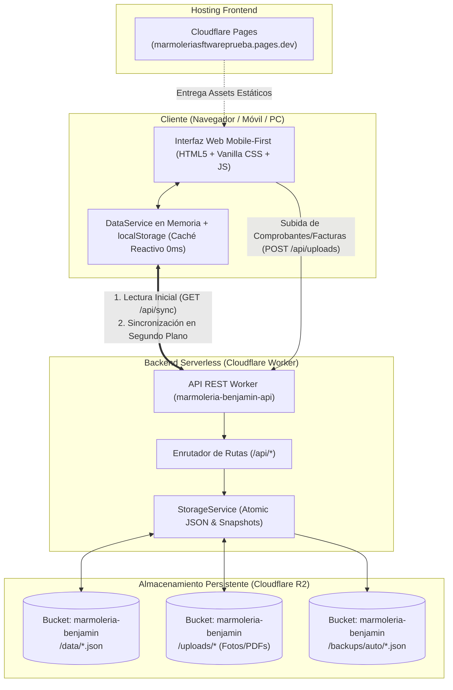

# Marmolería Benjamín — Arquitectura del Sistema y Fases de Desarrollo

Este documento detalla la arquitectura técnica integral, el flujo de datos y el plan de fases actualizado para el sistema administrativo de **Marmolería Benjamín**.

---

## 1. Diagrama de Arquitectura General

El sistema sigue un modelo **Serverless Decoupled** (desacoplado sin servidores fijos ni bases de datos SQL tradicionales), optimizado para velocidad instantánea, cero mantenimiento y costo $0 dentro del free tier de Cloudflare.



---

## 2. Flujo de Datos y Sincronización Híbrida

1. **Arranque Instantáneo (`GET /api/sync`):**
   - Al cargar la página, el navegador consulta al Worker todos los registros consolidados en una sola llamada ultrarrápida.
   - Si no hay conexión o falla la red, el sistema inicia de inmediato utilizando la copia de contingencia de `localStorage`.
2. **Respuesta Visual en 0 Milisegundos:**
   - Cada alta, modificación o baja (`create`, `update`, `remove`) actualiza de inmediato la memoria del navegador y la vista.
   - En segundo plano, se envía la petición HTTP al Worker de Cloudflare para persistir en R2.
3. **Persistencia Atómica en R2:**
   - Antes de modificar cualquier archivo JSON, `storageService` genera un snapshot preventivo en `backups/auto/`.
   - La escritura del nuevo JSON se realiza de forma atómica en el bucket `marmoleria-benjamin`.
4. **Almacenamiento de Archivos Binarios:**
   - Fotos de facturas, planos y comprobantes de transferencias se envían a `/api/uploads` y se alojan en R2 con previsualización directa en el navegador.

---

## 3. Mapa de Archivos y Colecciones en Cloudflare R2

```
r2://marmoleria-benjamin/
├── data/
│   ├── clientes.json           ← Clientes, teléfonos, CUIT, direcciones y saldos
│   ├── presupuestos.json       ← Presupuestos con cálculo por m², ítems y adicionales
│   ├── obras.json              ← Obras en curso, instaladores, ficha técnica y avances
│   ├── materiales.json         ← Catálogo: precio por m², stock mínimo y categorías
│   ├── stock-movimientos.json  ← Entradas, salidas a obra, ajustes y devoluciones
│   ├── proveedores.json        ← Proveedores y estado de cuenta corriente
│   ├── facturas.json           ← Facturas recibidas, notas de crédito y débito
│   ├── pagos.json              ← Pagos emitidos a proveedores con comprobantes adjuntos
│   ├── cobros.json             ← Recibos oficiales de cobro a clientes y obras
│   ├── eventos.json            ← Calendario de mediciones, colocaciones y cobranzas
│   └── config.json             ← Datos fiscales de la empresa, logo y cotización dólar
├── uploads/
│   ├── facturas/               ← Fotos o PDFs de facturas de proveedores
│   ├── comprobantes/           ← Comprobantes de pago / transferencias
│   └── obras/                  ← Fotos de obra y planos técnicos
└── backups/
    └── auto/                   ← Copias de seguridad automáticas previas a cada guardado
```

---

## 4. Estado y Roadmap de Fases del Proyecto

```
┌────────────────────────────────────────────────────────┐
│  ESTADO DEL SISTEMA                                    │
├────────────────────────────────────────────────────────┤
│  ✅ FASE 1: Frontend Operativo Mobile-First            │
│  ✅ FASE 2: Backend Cloudflare Worker + R2 Storage     │
│  ⏳ FASE 3: Automatizaciones y Control Operativo       │
│  ⏳ FASE 4: Roles y Accesos (Admin vs Taller/Obra)     │
│  ⏳ FASE 5: Puesta en Marcha en Taller & Datos Reales  │
└────────────────────────────────────────────────────────┘
```

---

### ✅ FASE 1: Frontend Operativo Mobile-First (Completada 100%)
- **Módulos Desarrollados:** Dashboard, Clientes, Presupuestos, Obras, Stock e Inventario, Proveedores, Facturas, Pagos, Cobros, Calendario Operativo y Configuración.
- **Lógica de Marmolería:**
  - Presupuestos con cálculo dinámico por m² y adicionales (bachas, traforos, zócalos, frentes dobles, pegado bajo mesada).
  - Catálogo de materiales con precio por m² y categorías (Granitos Nacionales, Importados, Mármoles, Cuarzo/Silestone, Porcelánicos).
  - Emisión de Fichas Técnicas para taller y colocación en obra.
  - Recibos oficiales de cobro y presupuestos con exportación a PDF y Word (.doc).
  - Integración de logo oficial en cabeceras, barra lateral y documentos generados.

---

### ✅ FASE 2: Backend Cloudflare Worker + R2 Storage (Completada 100%)
- **Worker Desplegado:** `https://marmoleria-benjamin-api.davidlaid1998.workers.dev`
- **Frontend Vinculado:** `https://marmoleriasftwareprueba.pages.dev`
- **Bucket R2 Activo:** `marmoleria-benjamin` con almacenamiento sin bases de datos SQL tradicionales.
- **Gestión de Archivos Binarios:** Subida multipart de comprobantes y fotos de facturas a R2 con visor y previsualización modal integrada en Facturas, Pagos y Cobros.
- **Tolerancia a Fallos:** Blindaje contra inconsistencias o retardos de red con salvaguarda en memoria local.

---

### ⏳ FASE 3: Automatizaciones de Negocio y Control Operativo (Próxima Fase)
*Objetivo: Conectar los módulos entre sí para evitar tareas manuales duplicadas y alertar proactivamente.*

1. **Descuento Automático de Stock por Obra Aprobada:**
   - Al cambiar un presupuesto a "Aprobado" o generar una Obra, permitir en 1 clic dar salida al stock de los m² o placas correspondientes.
2. **Motor de Alertas Proactivas en Dashboard y Cabecera:**
   - **Alerta de Stock Crítico:** Aviso visual cuando un material quede por debajo de su `stockMinimo`.
   - **Vencimientos de Facturas:** Alertas a 7 y 3 días de facturas de proveedores por vencer o vencidas.
   - **Presupuestos Vencidos:** Aviso sobre presupuestos sin respuesta después del período de validez comercial.
3. **Actualizador Masivo de Precios por m²:**
   - Permite aplicar aumentos porcentuales generales o por categoría de material (ej. +10% en Granitos Importados por variación cambiaria) de forma instantánea.
4. **Centro de Resguardo & Descarga de Backups:**
   - Descarga en 1 clic de un archivo ZIP/JSON con todas las colecciones para resguardo físico en disco local y opción de restauración.

---

### ⏳ FASE 4: Roles y Perfiles de Acceso (Taller vs. Administración)
*Objetivo: Permitir que operarios y colocadores usen la app en celulares sin exponer datos financieros sensibles.*

1. **Perfil Administrador (Dueño / Oficina Comercial):**
   - Acceso total a precios de costo, facturas de proveedores, balances, márgenes y cuentas corrientes.
2. **Perfil Taller / Colocador:**
   - Interfaz simplificada para operarios:
     - Ver lista de **Obras** asignadas y abrir la **Ficha Técnica** (medidas, traforos, planos y fotos).
     - Ver el **Calendario** con mediciones y colocaciones del día.
     - Registrar mermas o consumo de placas en Stock.
     - Ocultamiento de costos de compra y márgenes financieros.

---

### ⏳ FASE 5: Puesta en Marcha en Taller & Migración de Datos Reales
*Objetivo: Migración definitiva de planillas Excel al sistema en el día a día del taller.*

1. **Importador de Datos desde Excel/CSV:**
   - Asistente para cargar en masa clientes históricos, proveedores y lista de precios actual.
2. **Instalación como App Nativa (PWA):**
   - Configuración de manifiesto web para que los celulares de los colocadores y operarios instalen la app como icono en la pantalla de inicio (sin barra de navegador).
3. **Pruebas de Campo:**
   - Verificación de uso táctil con guantes de taller y fotos de remitos en obra con conectividad móvil 4G.
